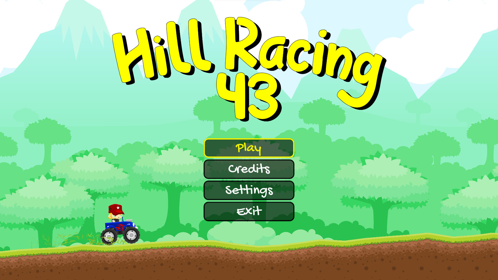
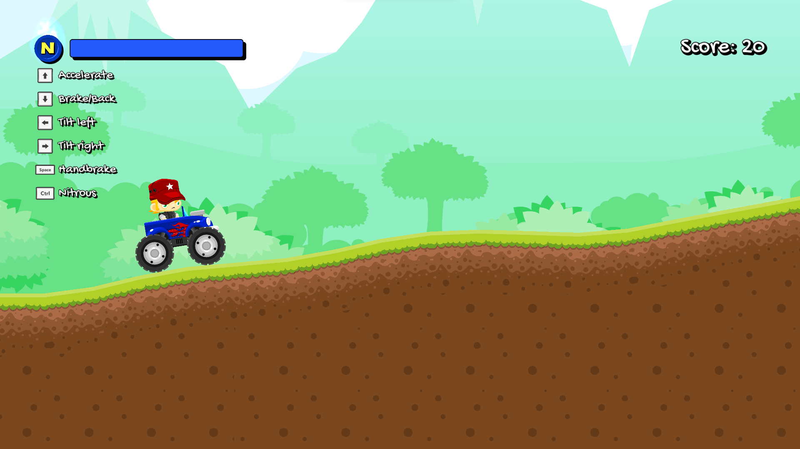
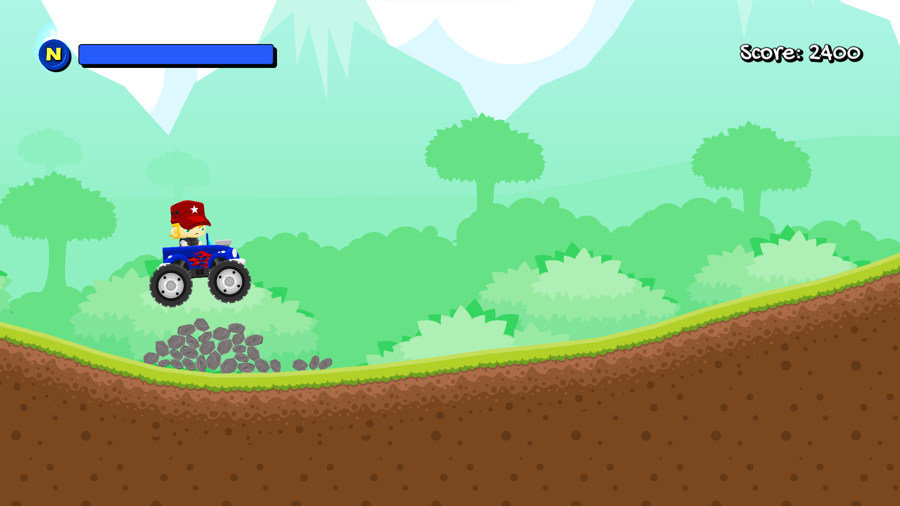
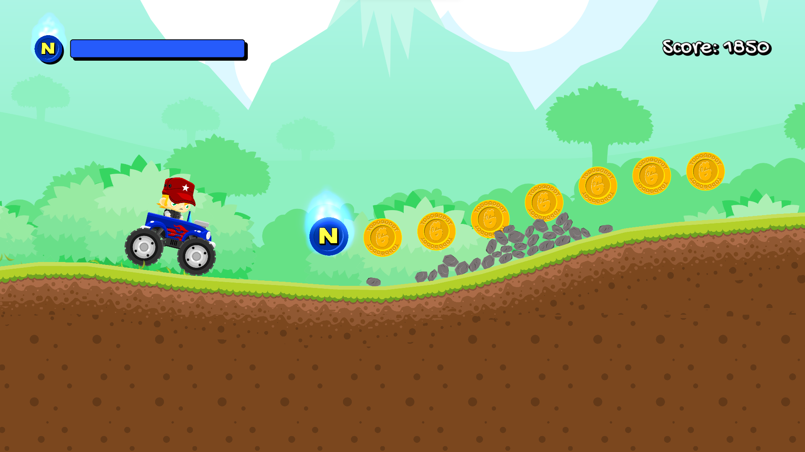

# Hill Racing 43: Godot 4.3 Parallax2D Game Demo for Todogodot

Demo of one of the most interesting features of Godot: the improved Parallax2D system that allows you to use any Node2D as a node within the parallax.

Also, in this demo we show you how to make a procedurally generated infinite terrain.

